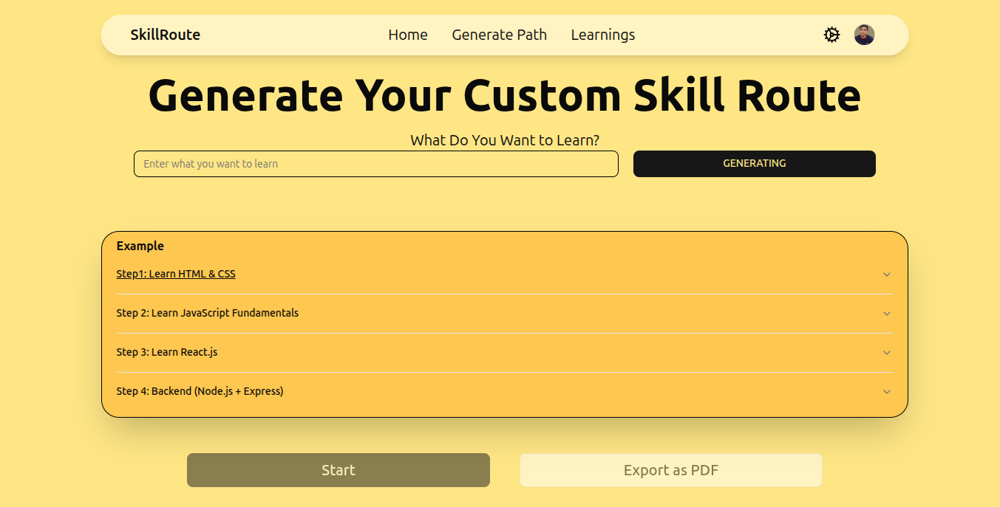
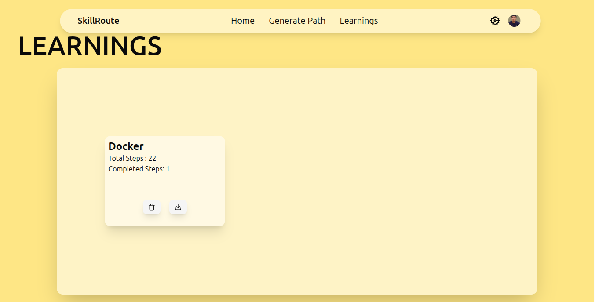
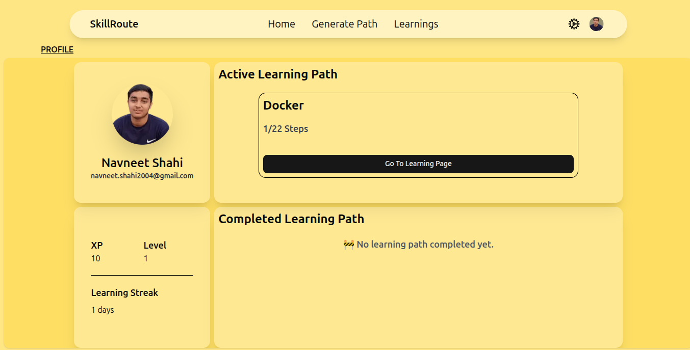

```md
# 🧠 AI Learning Path Generator

An intelligent and dynamic learning assistant that creates **personalized AI-generated learning paths** tailored to users' goals, levels, and pace — combining power from OpenAI, LangChain, and Hugging Face.


---

## 🚀 Live Demo

🔗 [Try It Live](https://ai-learning-path-generator.vercel.app/)

---

## 🌟 Features

- 🤖 Personalized learning paths using OpenAI & LangChain  
- 🔍 Smart content summarization  
- 📈 Progress analytics & gamification (XP, streaks, badges)  
- 📤 Export your path as PDF  
- 🔐 Secure authentication via Clerk  
- 🎨 Beautiful UI with `shadcn/ui`  
- 🧩 Interactive visuals with Spline  
- 🔗 Shareable learning experiences  

---

## 🧠 AI Stack

| Tool             | Purpose                                           |
|------------------|---------------------------------------------------|
| **OpenAI API**   | Natural language understanding & generation       |
| **LangChain**    | AI agents, tool chaining, and context management  |
| **Hugging Face** | Pretrained models for summaries & embeddings      |

---

## 🛠️ Tech Stack

| Frontend            | Backend     | AI/ML                         | Auth   | DB       | UI/3D              |
|---------------------|-------------|-------------------------------|--------|----------|--------------------|
| Next.js + Tailwind  | NestJS      | OpenAI, LangChain, Hugging Face | Clerk  | MongoDB  | shadcn/ui, Spline  |

---

## 📸 Screenshots

*(Add real screenshots or screen recordings of your app in use here)*






---

## 🧪 Run Locally

### 1. Clone the Repo

```bash
git clone https://github.com/navneetshahi14/AILearningPathGenerator.git
````

### 2. Backend

```bash
cd AILearningPathGenerator/backend
pnpm install
pnpm start:dev
```

### 3. Frontend

```bash
cd ../frontend
pnpm install
pnpm dev
```

---

## 🔑 Environment Variables

Make sure to configure your `.env` files:

#### Backend `.env`

```env
OPENAI_API_KEY=
HUGGINGFACE_API_KEY=
MONGO_URI=
FRONTEND_URL=
```

#### Frontend `.env`

```env
NEXT_PUBLIC_CLERK_PUBLISHABLE_KEY=
NEXT_PUBLIC_BACKEND_URL=
```

---

## 🙌 Contributing

Open to new contributors, suggestions, and collaborations!
Feel free to fork, star ⭐, and submit PRs or issues.

---

## 📧 Contact

Made with ❤️ by [Navneet Shahi](https://www.linkedin.com/in/navneet-shahi-a8762824b)
📫 Email: [navneet.shahi2004@gmail.com](mailto:navneet.shahi2004@gmail.com)

---

## 📄 License

This project is licensed under the [MIT License](https://opensource.org/licenses/MIT).
Feel free to use, modify, and distribute it with attribution.

```
